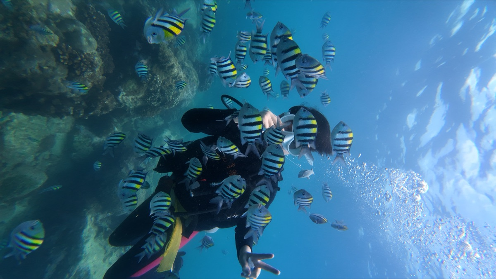
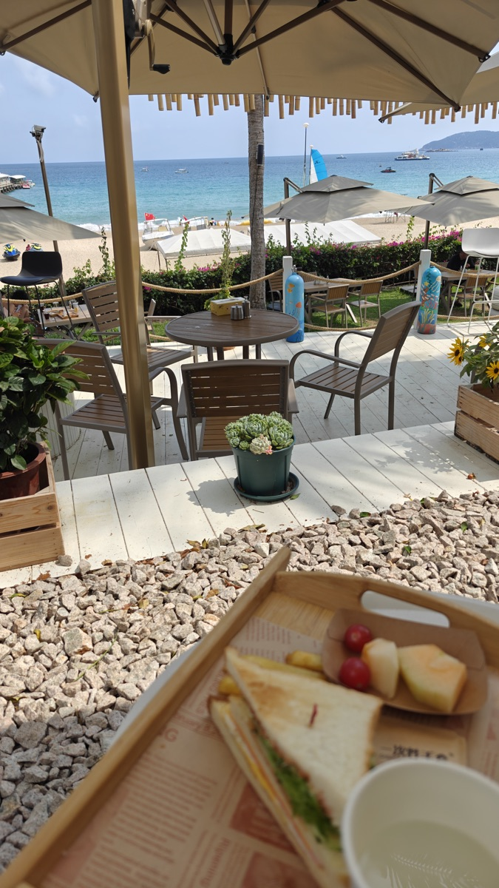
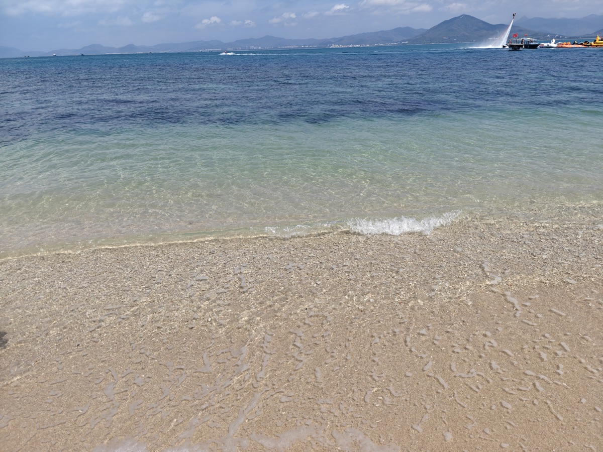
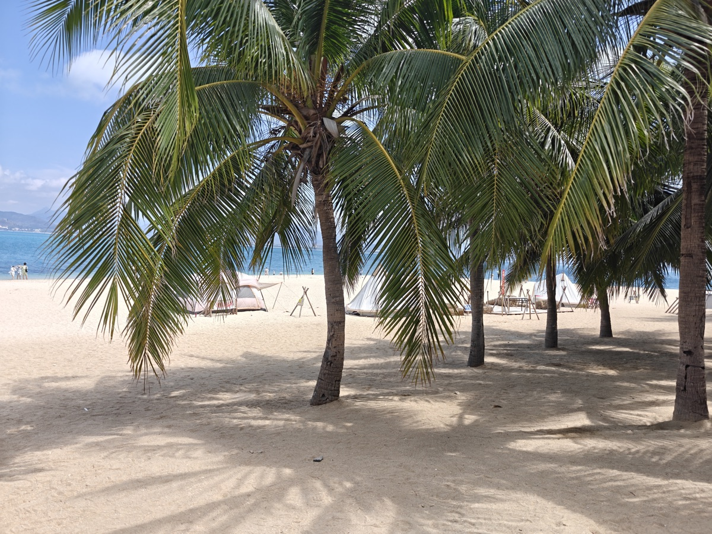
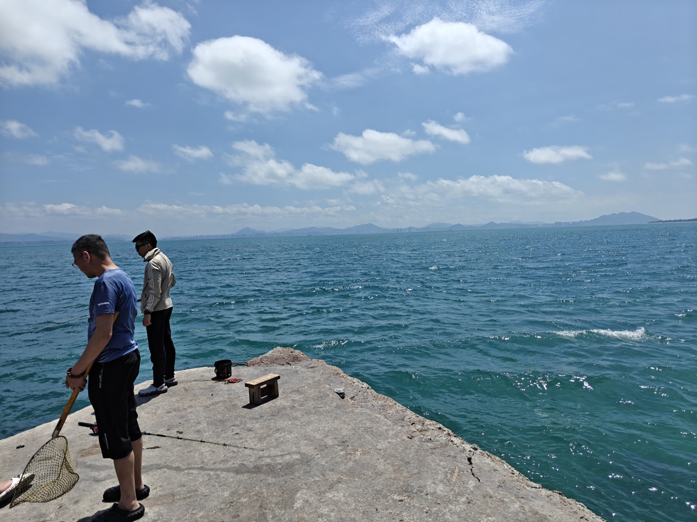
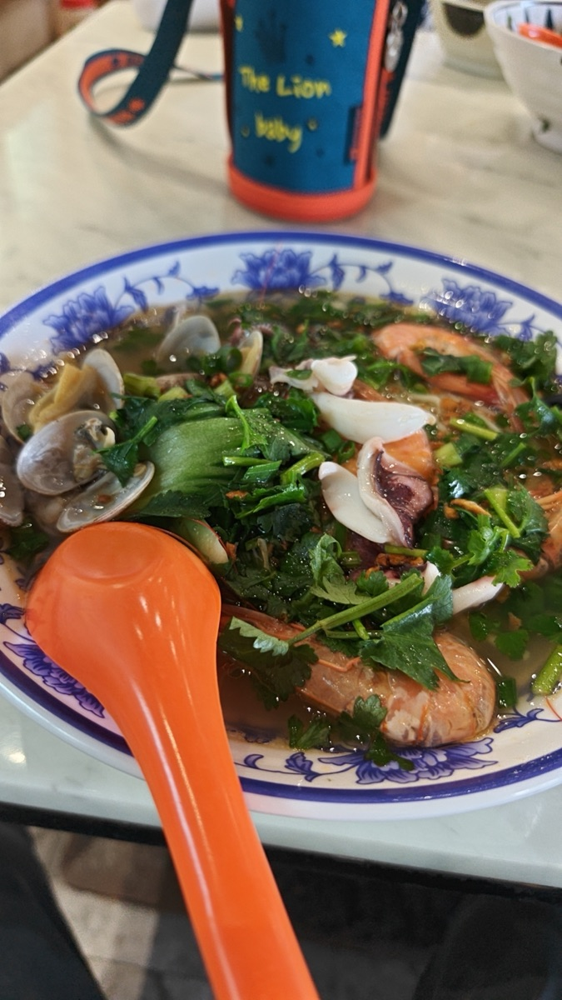
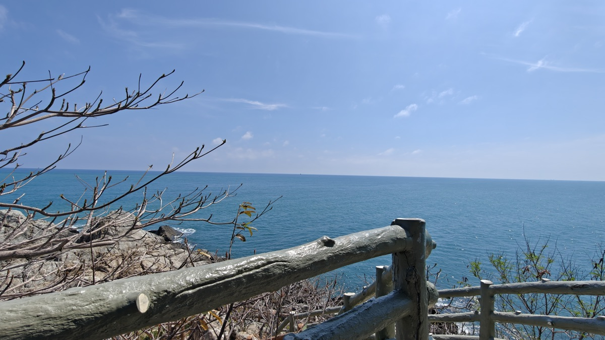
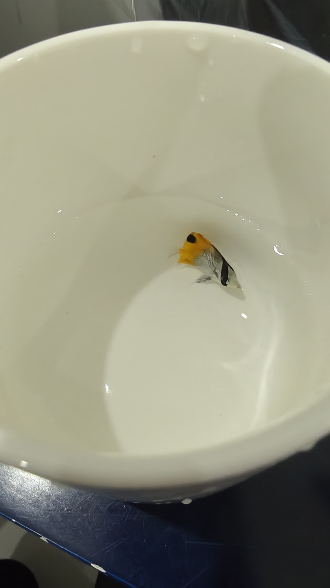
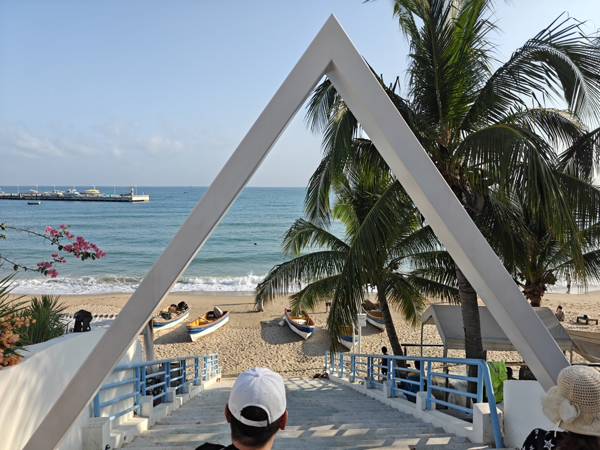

A collection of places I've visited. Newest trips first.

<!-- 添加新旅行时，复制下面的模板并填入真实信息，放在最上面 -->

## 2025.04 — Yalong Bay（亚龙湾）

:::: {.travel-card}

::: {.travel-date}
April 26, 2025
:::

::: {.travel-location}
Yalong Bay, Sanya, China
:::

Went scuba diving at Yalong Bay — crystal-clear water and colorful coral reefs beneath the surface.

::: {.travel-gallery}

:::

::::

## 2025.04 — West Island（西岛）

:::: {.travel-card}

::: {.travel-date}
April 20–21, 2025
:::

::: {.travel-location}
West Island (Xidao), Sanya, China
:::

Spent two days on West Island — sandy beaches, swaying coconut palms, and turquoise sea. Tried beachcombing at low tide and even caught a tropical fish by hand.

::: {.travel-gallery}

:::

::::

## 2025.04 — Tianya Town（天涯小镇）

:::: {.travel-card}

::: {.travel-date}
April 19–20, 2025
:::

::: {.travel-location}
Tianya Town, Sanya, China
:::

First stop in Sanya — the cozy Tianya Town with an ocean-view room overlooking the South China Sea. Forecast said cloudy, but turned out bright and sunny.

::: {.travel-gallery}

:::

::::
